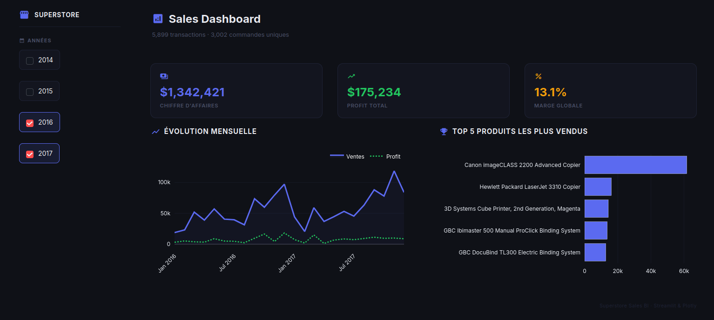

# 📦 Superstore Sales BI

Projet d'analyse de données et de Business Intelligence basé sur le dataset [Superstore de Kaggle](https://www.kaggle.com/datasets/vivek468/superstore-dataset-final).



## Description

Pipeline ETL complet + dashboard interactif pour analyser les ventes, profits et performances d'un superstore américain par produit, région, catégorie et segment client.

## Technologies

- **Python 3.12** — ETL & traitement des données
- **Pandas** — manipulation des données
- **Streamlit + Plotly** — dashboard interactifS
- **uv** — gestion des dépendances

## Structure


```

sales_analysis_bi/
├── data/
│   ├── superstore.csv      # Données brutes
│   ├── order.csv
│   ├── product.csv
│   ├── customer.csv
│   └── sales.csv
├── etl.py                  # Pipeline ETL
├── dashboard.py            # Dashboard Streamlit
└── pyproject.toml

```

## Installation & lancement

```bash
# 1. Installer les dépendances
uv sync

# 2. Lancer le pipeline ETL
uv run etl.py

# 3. Lancer le dashboard
uv run streamlit run dashboard.py

```

Accéder au dashboard sur : http://localhost:8501

### Aperçu du Dashboard

## Dataset

* **Source** : [Superstore Dataset Final — Kaggle](https://www.kaggle.com/datasets/vivek468/superstore-dataset-final)
* **Volume** : ~10 000 transactions
* **Colonnes** : commandes, clients, produits, ventes, profits, remises

